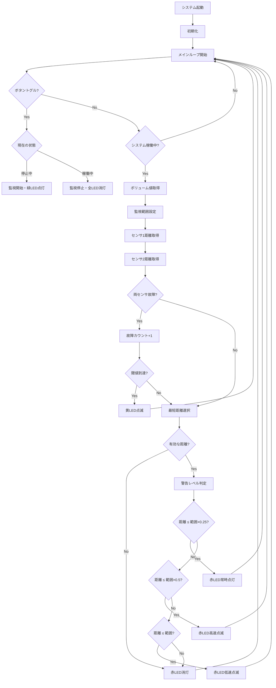
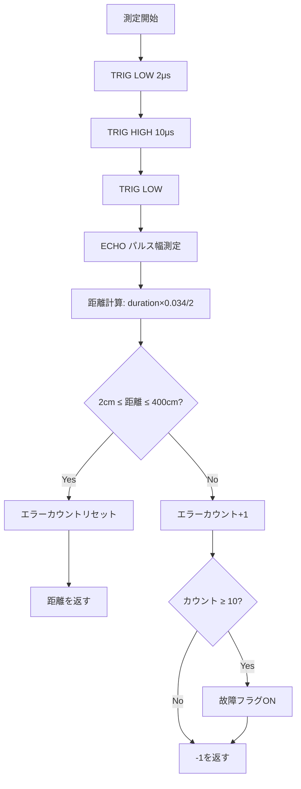

# 衝突警告システム 仕様書

**バージョン**: 2.1  
**最終更新日**: 2025年11月21日  
**プロジェクト**: arduino_sample - Dual Sensor Collision Warning System

---

## 1. システム概要

### 1.1 目的
デュアル超音波距離センサを用いた衝突警告システム。監視範囲内の物体を検知し、接近距離に応じてLEDで段階的な警告を行う。

### 1.2 特徴
- **デュアルセンサ構成**: 2つのセンサで広範囲をカバー、死角を低減
- **段階的警告**: 接近距離に応じた3段階の警告表示
- **冗長性**: 片方のセンサ故障時も継続動作可能
- **可変距離パラメータ**: ボリュームで3つの動作モード切替（長距離/中距離/短距離）
- **高度な外れ値検出**: 差分ベースの異常値判定で測定精度を向上

---

## 2. ハードウェア仕様

### 2.1 使用部品

| 部品名 | 型番/仕様 | 数量 | 用途 |
|:---|:---|:---:|:---|
| マイコン | Arduino Uno/Mega | 1 | システム制御 |
| 超音波センサ | HC-SR04 | 2 | 距離測定 |
| LED（緑） | 5mm | 1 | 監視状態表示 |
| LED（赤） | 5mm | 1 | 警告表示 |
| LED（黄） | 5mm | 1 | 故障通知/拡張用 |
| ボリューム | 10kΩ可変抵抗 | 1 | 監視範囲調整 |
| プッシュボタン | タクトスイッチ | 1 | 開始/停止トグル |
| 抵抗 | 220Ω | 3 | LED電流制限 |
| 抵抗 | 10kΩ | 1 | ボタンプルアップ（オプション） |

### 2.2 ピン配置

| 機能 | Arduino ピン | 信号方向 | 備考 |
|:---|:---:|:---:|:---|
| センサ1 TRIG | 8 | OUT | 超音波送信トリガー |
| センサ1 ECHO | 9 | IN | 超音波受信 |
| センサ2 TRIG | 4 | OUT | 超音波送信トリガー |
| センサ2 ECHO | 5 | IN | 超音波受信 |
| LED 緑 | 11 | OUT | 監視状態表示 |
| LED 赤 | 10 | OUT | 警告表示（PWM対応） |
| LED 黄 | 6 | OUT | エラー表示（PWM対応） |
| ボリューム | A0 | IN | アナログ入力（モード選択） |
| トグルボタン | 13 | IN | デジタル入力（内部PULLUP） |

> **注意**: LED黄（ピン6）とセンサ1 ECHO（ピン9）は異なるピンを使用しています。以前のバージョンではピン6の競合がありましたが、現在は解消されています。

### 2.3 配線図（概要）

```
センサ1 (HC-SR04)
  VCC  --> 5V
  TRIG --> Pin 8
  ECHO --> Pin 9
  GND  --> GND

センサ2 (HC-SR04)
  VCC  --> 5V
  TRIG --> Pin 4
  ECHO --> Pin 5
  GND  --> GND

LED制御
  Pin 11 --> [220Ω] --> 緑LED --> GND
  Pin 10 --> [220Ω] --> 赤LED --> GND
  Pin 6  --> [220Ω] --> 黄LED --> GND

ボリューム
  端子1 --> 5V
  端子2 --> Pin A0
  端子3 --> GND

ボタン
  端子1 --> Pin 13 (内部PULLUP有効)
  端子2 --> GND
```

---

## 3. ソフトウェア仕様

### 3.1 システム構成

```
arduino_sample/
├── arduino_sample.ino           # メインスケッチ
├── arduino_sample.h             # 統合ヘッダーファイル
├── DistanceSensor.cpp           # 距離センサクラス実装
├── LedController.cpp            # LED制御クラス実装
├── VolumeController.cpp         # ボリューム制御クラス実装
├── ButtonController.cpp         # ボタン制御クラス実装
└── CollisionWarningSystem.cpp   # システム統合クラス実装
```

### 3.2 クラス設計

#### 3.2.1 DistanceSensor クラス

**責務**: 超音波距離センサの制御と故障検知

**主要メソッド**:
- `begin()`: センサ初期化
- `getDistance()`: 距離測定（cm単位）
- `isFaulty()`: 故障判定
- `resetErrorCount()`: エラーカウントリセット

**動作仕様**:
- 測定範囲: 2～400cm
- 測定精度: ±1cm
- 故障判定閾値: 連続10回の異常値
- **外れ値検出**: 前回測定値との差分が200cm（maxDistance/2）以上の場合、異常値として判定

#### 3.2.2 LedController クラス

**責務**: 3つのLEDの制御

**主要メソッド**:
- `begin()`: LED初期化
- `setMonitoringActive(bool)`: 緑LED制御
- `setWarningLevel(level, distance, range, slowThreshold, fastThreshold, solidThreshold)`: 警告レベル設定
- `updateBlink()`: 点滅更新
- `displayFault()`: エラー通知（黄LED点滅）
- `clearFault()`: エラーモード解除
- `turnOffAll()`: 全LED消灯

**警告レベル**:
```cpp
enum WarningLevel {
    OFF = 0,           // 消灯
    SLOW_BLINK = 1,    // 低速点滅（500ms）
    FAST_BLINK = 2,    // 高速点滅（200ms）
    SOLID = 3          // 常時点灯
};
```

#### 3.2.3 VolumeController クラス

**責務**: ボリュームからの距離パラメータ設定値取得

**主要メソッド**:
- `begin()`: 初期化
- `getDistanceParameters(float&, float&, float&)`: 距離パラメータ取得

**動作モード** (ボリューム値で自動切替):

| モード | ボリューム値 | 低速点滅 | 高速点滅 | 常時点灯 | 用途 |
|:---:|:---:|---:|---:|---:|:---|
| **長距離** | 0-256 | 400cm | 200cm | 50cm | 広範囲監視 |
| **中距離** | 257-767 | 300cm | 150cm | 50cm | 標準監視 |
| **短距離** | 768-1024 | 200cm | 100cm | 50cm | 近距離監視 |

#### 3.2.4 ButtonController クラス

**責務**: ボタン入力処理（デバウンス・トグル）

**主要メソッド**:
- `begin()`: 初期化
- `isPressed()`: 押下状態取得
- `wasToggled()`: トグル検出
- `getToggleState()`: 現在のトグル状態

**デバウンス時間**: 50ms

#### 3.2.5 CollisionWarningSystem クラス

**責務**: システム全体の統合制御

**主要メソッド**:
- `begin()`: システム初期化
- `update()`: メインループ処理
- `toggleSystem()`: 監視開始/停止切替
- `getMinDistance(dist1, dist2)`: 最短距離取得

---

## 4. 機能仕様

### 4.1 動作モード

#### 4.1.1 停止モード
- 全LED消灯
- センサ測定停止
- ボタン監視のみ実行

#### 4.1.2 監視モード
- 緑LED常時点灯
- センサ測定実行
- 監視範囲外: 赤LED消灯
- 監視範囲内: 警告表示

#### 4.1.3 警告モード
- 緑LED常時点灯
- 赤LED表示（距離に応じて変化）

#### 4.1.4 エラーモード
- 黄LED点滅（500ms間隔）
- センサ測定値が異常（minDistance < 0）の場合にエラー表示
- 正常復帰時は自動的に黄LED消灯

### 4.2 警告アルゴリズム（ボリューム連動型）

```
ボリューム値 = analogRead(A0)

// モード判定と距離パラメータ取得
if ボリューム値 <= 256:
    低速点滅閾値 = 400cm
    高速点滅閾値 = 200cm
    常時点灯閾値 = 50cm
elif ボリューム値 <= 767:
    低速点滅閾値 = 300cm
    高速点滅閾値 = 150cm
    常時点灯閾値 = 50cm
else:
    低速点滅閾値 = 200cm
    高速点滅閾値 = 100cm
    常時点灯閾値 = 50cm

検知距離 = min(センサ1距離, センサ2距離)

// 警告レベル判定
if 検知距離 < 0:
    黄LED: 点滅（エラー表示）
    
elif 検知距離 <= 常時点灯閾値:
    赤LED: 常時点灯（最接近警告）
    
elif 検知距離 <= 高速点滅閾値:
    赤LED: 高速点滅 200ms間隔（中距離警告）
    
elif 検知距離 <= 低速点滅閾値:
    赤LED: 低速点滅 500ms間隔（遠距離警告）
    
else:
    赤LED: 消灯（監視範囲外）
```

### 4.3 センサ外れ値検出

#### 外れ値判定条件
- **差分ベース判定**: `|現在値 - 前回値| >= 200cm` の場合、外れ値として判定
- 連続10回以上の外れ値検出でセンサを故障とマーク

#### 外れ値検出の利点
- 突発的なノイズや反射エラーを効果的に除去
- 物理的に不可能な急激な距離変化を検出
- 測定精度の向上とシステム安定性の確保

#### エラー時の動作
- **片方エラー**: 正常なセンサで継続動作
- **両方エラー**: 黄LED点滅、minDistance = -1を返す

---

## 5. 処理フロー

### 5.1 メインフロー



### 5.2 センサ測定フロー



---

## 6. データ仕様

### 6.1 定数定義

| 定数名 | 値 | 単位 | 説明 |
|:---|---:|:---:|:---|
| センサ最大距離 | 400 | cm | 測定可能最大距離 |
| 外れ値判定閾値 | 200 | cm | maxDistance/2（差分ベース） |
| 故障判定閾値 | 10 | 回 | 連続異常値回数 |
| デバウンス時間 | 50 | ms | ボタンデバウンス |
| 低速点滅間隔 | 500 | ms | 遠距離警告 |
| 高速点滅間隔 | 200 | ms | 中距離警告 |
| エラー点滅間隔 | 500 | ms | 黄LED点滅 |

### 6.2 距離パラメータ定数

| モード | ボリューム範囲 | 低速点滅 | 高速点滅 | 常時点灯 |
|:---|:---:|---:|---:|---:|
| 長距離 | 0-256 | 400cm | 200cm | 50cm |
| 中距離 | 257-767 | 300cm | 150cm | 50cm |
| 短距離 | 768-1024 | 200cm | 100cm | 50cm |

### 6.3 状態変数

| 変数名 | 型 | 初期値 | 説明 |
|:---|:---|:---|:---|
| systemRunning | bool | false | システム稼働状態 |
| currentLevel | WarningLevel | OFF | 現在の警告レベル |
| toggleState | bool | false | ボタントグル状態 |
| faultCounter | int | 0 | エラー検出カウンタ |
| errorMode | bool | false | エラーモード状態 |
| lastDistance | long | 0 | 前回測定距離（外れ値判定用） |
| errorCount | int | 0 | センサエラーカウント |

---

## 7. シリアル通信仕様

### 7.1 通信設定
- ボーレート: 9600 bps
- データビット: 8
- パリティ: なし
- ストップビット: 1

### 7.2 出力フォーマット

#### 初期化時
```
=================================
Collision Warning System Initialized
Dual Sensor Configuration
Press button to toggle monitoring
=================================
```

#### システム開始時
```
>>> System STARTED <<<
```

#### システム停止時
```
>>> System STOPPED <<<
```

#### 通常動作時（100ms間隔）
```
[DATA] Slow: 400 cm | Fast: 200 cm | Solid: 50 cm | S1: 85 cm | S2: 92 cm | Min: 85 cm [WARNING]
```

#### エラー検知時
```
[DEBUG] Sensor TRIG=8 error: distance=0 cm, errorCount=5
[WARN] Sensor TRIG=8 marked as FAULTY
```

**出力項目説明**:
- `Slow`: 低速点滅閾値（現在のモード）
- `Fast`: 高速点滅閾値（現在のモード）
- `Solid`: 常時点灯閾値（現在のモード）
- `S1`: センサ1の測定距離（ERR=外れ値/異常値）
- `S2`: センサ2の測定距離（ERR=外れ値/異常値）
- `Min`: 採用された最短距離（-1=両センサエラー）
- `[WARNING]` / `[CLEAR]`: 警告状態表示

---

## 8. 性能仕様

### 8.1 タイミング仕様

| 項目 | 値 | 備考 |
|:---|---:|:---|
| メインループ周期 | 100 | ms |
| センサ測定周期 | 100 | ms（メインループに同期） |
| センサ測定時間 | 約30 | ms（最大） |
| LED更新周期 | 可変 | 点滅パターンに依存 |
| ボタン応答時間 | < 150 | ms（デバウンス含む） |

### 8.2 精度仕様

| 項目 | 仕様 |
|:---|:---|
| 距離測定精度 | ±1 cm（HC-SR04仕様） |
| 監視範囲設定分解能 | 約0.26 cm/step（270cm÷1024） |
| 応答時間 | < 200 ms |

---

## 9. 使用方法

### 9.1 初期セットアップ
1. ハードウェアを仕様通りに配線
2. Arduino IDEでスケッチを開く
3. ボードとポートを選択
4. コンパイル・アップロード

### 9.2 基本操作
1. シリアルモニタを開く（9600 bps）
2. トグルボタンを1回押す → 監視開始（緑LED点灯）
3. ボリュームを回して動作モードを選択
   - 左側（0-256）: 長距離モード（400/200/50cm）
   - 中央（257-767）: 中距離モード（300/150/50cm）
   - 右側（768-1024）: 短距離モード（200/100/50cm）
4. 物体を近づけると赤LEDが点滅/点灯
   - 遠距離: 低速点滅（500ms）
   - 中距離: 高速点滅（200ms）
   - 近距離: 常時点灯
5. センサエラー時は黄LED点滅
6. トグルボタンを再度押す → 監視停止（全LED消灯）

### 9.3 ログ記録（オプション）

シリアル出力を日時付きでファイルに保存できます。

#### 必要なライブラリ
```bash
pip install pyserial
```

#### ログ記録の開始
```bash
# Windows
start_logger.bat

# または
python serial_logger.py
```

#### ログファイル
- 保存先: `logs/arduino_log_YYYYMMDD_HHMMSS.txt`
- 形式: 日時付きテキスト形式
- 詳細: `SERIAL_LOGGER_README.md` を参照

### 9.4 動作確認項目
- [ ] 緑LED: ボタン押下で点灯/消灯
- [ ] 赤LED: 距離に応じて消灯→低速点滅→高速点滅→点灯
- [ ] 黄LED: センサエラー時に点滅、正常復帰時に消灯
- [ ] ボリューム: 3つのモードが切り替わる（シリアル出力で確認）
- [ ] シリアル出力: 距離情報と距離パラメータが正しく表示
- [ ] 外れ値検出: 急激な距離変化でERR表示されることを確認

---

## 10. トラブルシューティング

### 10.1 よくある問題

| 症状 | 原因 | 対処方法 |
|:---|:---|:---|
| センサが反応しない | 配線ミス | ピン配置を確認（TRIG=8/ECHO=9, TRIG=4/ECHO=5） |
| 距離が不安定 | センサ設置角度、障害物 | センサを水平に設置、反射面を確認 |
| 頻繁にERR表示 | 外れ値検出 | 正常動作（急激な変化を検出している） |
| LEDが点灯しない | 抵抗値/配線 | 220Ω抵抗を確認 |
| ボタンが反応しない | 配線/PULLUP設定 | Pin13の配線確認 |
| 黄LEDが常に点滅 | 両センサエラー | センサ配線・電源確認、ピン競合チェック |
| モードが切り替わらない | ボリューム配線 | A0ピン配線確認 |
| センサ1が常にERR | ピン競合の可能性 | ピン6とピン9の配線を再確認 |

### 10.2 デバッグ方法
1. シリアルモニタで出力を確認（9600 bps）
2. 各センサ値が正常に取得されているか確認
3. `ERR`表示がある場合:
   - 一時的: 外れ値検出（正常動作）
   - 連続的: センサ配線・電源を確認
4. 距離パラメータが変化しているか確認（Slow/Fast/Solid値）
5. `[DEBUG]`ログで詳細なエラー情報を確認
6. Python製シリアルロガーでログファイルを保存して分析

---

## 11. 技術的特徴

### 11.1 外れ値検出アルゴリズム

**差分ベース判定**の利点:
- 物理的に不可能な急激な距離変化を検出
- センサノイズや誤反射による異常値を除去
- 測定の連続性を保証し、システムの安定性を向上

**実装例**:
```cpp
if (abs(distance - lastDistance) >= maxDistance / 2) {
    errorCount++;
    return -1;  // 外れ値として扱う
}
lastDistance = distance;  // 正常値を記録
```

### 11.2 ボリューム連動型パラメータシステム

従来の可変範囲方式ではなく、**固定パラメータの3モード切替**方式を採用:
- 用途に応じた最適な警告距離を提供
- シンプルな操作性（ボリューム位置でモード選択）
- 予測可能な動作（距離パラメータが明確）

## 12. 拡張仕様（将来対応）

### 12.1 機能拡張案
- ブザー追加による音声警告
- EEPROM による設定保存
- 無線通信による遠隔監視
- センサ角度調整機構
- 温度補正機能（音速補正）

---

## 13. 変更履歴

| バージョン | 日付 | 変更内容 |
|:---:|:---|:---|
| 2.1 | 2025-11-21 | ボリューム連動型3モードシステム実装、差分ベース外れ値検出追加、エラー表示を黄LEDに変更 |
| 2.0 | 2025-01-20 | デュアルセンサ構成に変更、LED構成変更、トグルボタン方式採用 |
| 1.0 | 2025-01-20 | 初版リリース（シングルセンサ、RGBコンフィグ） |

---

## 14. 参考資料

- [Arduino公式リファレンス](https://www.arduino.cc/reference/en/)
- [HC-SR04データシート](https://cdn.sparkfun.com/datasheets/Sensors/Proximity/HCSR04.pdf)
- プロジェクトリポジトリ: arduino_sample
- クラス図: `doc/class_diagram.puml`
- シリアルロガー: `serial_logger.py`

---

**作成者**: GitHub Copilot  
**承認者**: -  
**文書管理番号**: SPEC-002.1-2025

---

©2024-2025 Mamezo Co.,Ltd.
