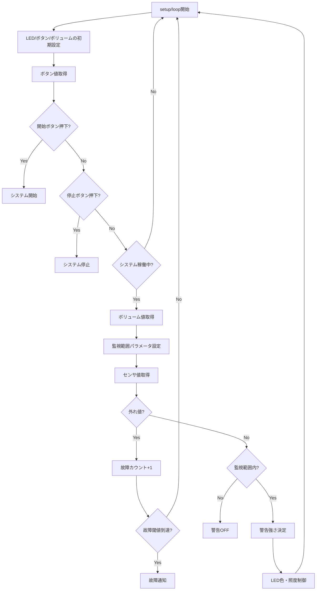

# arduino_sample

## プロジェクト概要

衝突警告装置のサンプル実装プロジェクトです。距離センサで監視範囲内の物体を検知し、接近距離に応じてLEDで警告を行います。オブジェクト指向型のC++でArduino向けに実装されています。

---

## システム仕様

### 主要機能

1. **距離監視**
   - 超音波距離センサで物体との距離を測定
   - ボリュームで監視範囲を調整可能（50～400cm）

2. **警告表示**
   - 接近距離に応じた3段階の警告レベル
     - **強（赤）**: 50cm以内
     - **中（黄）**: 50～100cm
     - **弱（緑）**: 100～200cm
   - 監視範囲外では警告OFF

3. **故障検知**
   - センサ異常値を連続検出した場合に故障と判定
   - 青色LED点滅で故障通知

4. **システム制御**
   - 開始ボタン: 監視開始
   - 停止ボタン: 監視停止・警告OFF

---

## ハードウェア構成

### 必要な部品

- Arduino（UnoまたはMega推奨）
- 超音波距離センサ（HC-SR04など）
- RGB LED（共通カソード）
- ボリューム（可変抵抗器）
- プッシュボタン × 2
- 抵抗（220Ω × 3、10kΩ × 2）
- ブレッドボード・ジャンパーワイヤー

### ピン配置

| 機能 | ピン番号 | 備考 |
|:---|:---|:---|
| 距離センサ TRIG | 8 | 出力 |
| 距離センサ ECHO | 9 | 入力 |
| LED RED | 9 | PWM |
| LED GREEN | 10 | PWM |
| LED BLUE | 11 | PWM |
| ボリューム | A0 | アナログ入力 |
| 開始ボタン | 2 | デジタル入力（PULLUP） |
| 停止ボタン | 3 | デジタル入力（PULLUP） |

---

## ソフトウェア構成

### クラス構成（オブジェクト指向型）

```
arduino_sample.h (統合ヘッダー)
├── DistanceSensor       : 距離センサ制御
├── LedController        : LED制御（警告表示・故障通知）
├── VolumeController     : ボリューム制御（監視範囲設定）
├── ButtonController     : ボタン制御（デバウンス処理付き）
└── CollisionWarningSystem : 統合制御システム
```

### ファイル構成

```
arduino_sample/
├── arduino_sample.ino           # メインスケッチ
├── arduino_sample.h             # 統合ヘッダーファイル
├── DistanceSensor.cpp           # 距離センサ実装
├── LedController.cpp            # LED制御実装
├── VolumeController.cpp         # ボリューム制御実装
├── ButtonController.cpp         # ボタン制御実装
├── CollisionWarningSystem.cpp   # システム統合実装
└── README.md                    # このファイル
```

---

## 使い方

### 1. ハードウェア接続

上記のピン配置に従って各部品を接続してください。

### 2. スケッチの書き込み

1. Arduino IDEでプロジェクトを開く
2. ボードとポートを選択
3. コンパイル＆アップロード

### 3. 動作確認

1. シリアルモニタを開く（9600bps）
2. 「Press START button to begin monitoring」と表示される
3. 開始ボタンを押すと監視開始
4. 物体を近づけると距離に応じてLEDの色が変化
5. 停止ボタンで監視停止

---

## 処理フロー



---

## ドキュメント

詳細な要件定義・設計・テスト仕様は以下を参照してください。

- [要件定義](doc/pdf_md/01_要求演習テンプレート.md)
- [設計仕様](doc/pdf_md/02_設計演習テンプレート.md)
- [テスト仕様](doc/pdf_md/03_テスト演習テンプレート.md)

---

## トラブルシューティング

### センサが反応しない
- 配線を確認してください
- センサとの距離が適切か確認（測定範囲: 2～400cm）

### LEDが点灯しない
- PWMピンに接続されているか確認
- 抵抗値が適切か確認（220Ω推奨）

### ボタンが反応しない
- PULLUP設定されているか確認
- デバウンス処理が動作しているか確認

---

## ライセンス

©2024-2025 Mamezo Co.,Ltd.

---

## 更新履歴

- 2025-01-20: オブジェクト指向型で再実装
- 2025-01-20: 統合ヘッダーファイル方式に変更
- 2025-01-20: README作成
